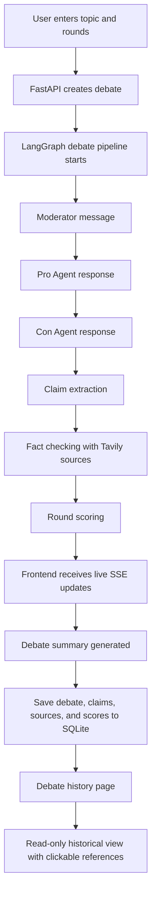

# AI Debate System

AI Debate System is a source-backed, multi-agent debate platform built with FastAPI, LangGraph, Groq, Tavily, SQLite, React, and Tailwind CSS. It lets you run structured debates between a Pro Agent and a Con Agent, track claims and references, score each round, and review debate history later.

## Live Demo 
Try it here - https://educational-ai-debate-system.vercel.app/

## Video Demo
https://github.com/user-attachments/assets/c1aff650-e6a9-4f30-a21b-5043bb17d00a

## Tech Stack

| Layer | Technologies Used |
| --- | --- |
| Frontend | React, Vite, TypeScript, Tailwind CSS, Lucide React |
| Backend | FastAPI, Python, Uvicorn, Pydantic, Pydantic Settings |
| AI Orchestration | LangGraph, Groq |
| Search and Evidence | Tavily |
| Database | SQLite |
| Testing | Pytest |
| Tooling | PostCSS, Autoprefixer |

## Overview

The system is designed to make arguments easier to compare in a practical way. Instead of reading a single opinion, you can observe both sides, inspect the supporting evidence, and see how the debate evolves across rounds.

It is useful for:

- Classroom discussions and learning exercises
- Critical thinking and reasoning practice
- Comparing both sides of a topic clearly
- Exploring policy, science, business, technology, and everyday decision-making topics
- Reviewing historical debates with saved claims and references

## Why This Project Is Unique

- It combines live debate generation with fact checking and source tracking in one workflow.
- It stores debate history so users can revisit past arguments instead of losing the session after the debate ends.
- It presents both sides of an issue side by side, which makes comparison more practical than a standard single-response chatbot.
- It supports real-time updates, so the debate can be observed as it unfolds rather than only after completion.
- It is useful both as a decision-support tool and as a learning aid for critical thinking and discussion practice.

## Real-Time Use Case

This project is useful when you want to watch an argument develop live. For example, a teacher can use it during class to compare two viewpoints on a topic, or a team can use it to explore a policy choice while the debate is still running. Because the scoring, fact checks, and references appear in real time, users can react to the evidence as it is produced.

## Use Cases

- Education and classroom discussion
- Research comparison and topic exploration
- Policy analysis and opinion comparison
- Brainstorming for business or product decisions
- Critical thinking and argument analysis
- Review of evidence-backed viewpoints in technical topics

## Features

- Live debate stream with a moderator, Pro Agent, and Con Agent
- Structured round-based debate flow
- Claim extraction from debate messages
- Automatic fact checking for checkable claims
- Reference capture and source saving for each fact check
- Round scoring for both sides
- Final debate summary generation
- Debate history view with saved debates
- Read-only historical debate mode
- Clickable reference links in historical fact checks
- Permanent delete flow with an in-app confirmation card
- Mobile-friendly navigation with a right-side slide-out drawer
- Placeholder-based new debate input for fresh debates
- About section with project explanation and security note
- Local fallback behavior when external API keys are missing

## Security Features

- Debate history is stored locally in SQLite by default.
- Historical debates are read-only, which reduces accidental edits to past records.
- Delete actions use a confirmation dialog before removing data permanently.
- Reference links are saved with fact checks so users can verify evidence directly.
- The backend has local fallback behavior, which helps the app remain usable without exposing external dependencies unnecessarily.
- The UI includes a security note reminding users to review data and references critically.

## How It Works

1. The user enters a topic and number of rounds.
2. The backend creates a debate record and starts the debate graph.
3. The moderator frames each round.
4. The Pro Agent and Con Agent respond in sequence.
5. Claims are extracted from each side.
6. Each claim is fact checked using retrieved sources.
7. Scores are calculated for the round.
8. The frontend receives live updates through Server-Sent Events.
9. The debate is stored in SQLite and can be opened later from history.
10. Historical debates open in read-only mode, with source links still clickable.

## Workflow Diagram



## Project Folder Structure

```text
AI_Debate_System/
├── backend/
│   ├── app/
│   │   ├── clients/
│   │   ├── debate/
│   │   ├── __init__.py
│   │   ├── config.py
│   │   ├── db.py
│   │   ├── guardrails.py
│   │   ├── main.py
│   │   └── schemas.py
│   ├── tests/
│   │   ├── test_db_sources.py
│   │   ├── test_groq_fallback.py
│   │   ├── test_guardrails.py
│   │   └── test_scoring.py
│   ├── pytest.ini
│   └── requirements.txt
├── frontend/
│   ├── src/
│   │   ├── App.tsx
│   │   ├── main.tsx
│   │   └── styles.css
│   ├── index.html
│   ├── package.json
│   ├── postcss.config.js
│   ├── tailwind.config.js
│   ├── tsconfig.json
│   └── vite.config.ts
├── scripts/
│   └── create_debate.py
├── README.md
└── .gitignore
```

## Project Structure Explainaation

| Path | Purpose |
| --- | --- |
| `README.md` | Project overview, setup, workflow, and structure documentation. |
| `.gitignore` | Ignores local build outputs, caches, environment files, and generated artifacts. |
| `temp_debate.json` | Temporary debate output file generated by local scripts or experiments. |
| `backend/` | FastAPI backend, debate engine, database logic, and tests. |
| `backend/requirements.txt` | Python dependencies for the backend. |
| `backend/pytest.ini` | Pytest configuration for backend tests. |
| `backend/app/__init__.py` | Marks the backend app package. |
| `backend/app/config.py` | Application settings and environment configuration. |
| `backend/app/db.py` | SQLite database helpers for debates, messages, claims, fact checks, sources, and scores. |
| `backend/app/guardrails.py` | Content guardrails and emoji stripping utilities. |
| `backend/app/main.py` | FastAPI app entry point and API routes. |
| `backend/app/schemas.py` | Pydantic request and response models. |
| `backend/app/clients/__init__.py` | Marks the clients package. |
| `backend/app/clients/groq.py` | Groq API client and fallback text generation logic. |
| `backend/app/clients/tavily.py` | Tavily search client and fallback source lookup logic. |
| `backend/app/debate/__init__.py` | Marks the debate package. |
| `backend/app/debate/graph.py` | LangGraph workflow that runs the debate, fact checking, scoring, and summary generation. |
| `backend/app/debate/scoring.py` | Round scoring logic. |
| `backend/tests/test_db_sources.py` | Regression test for saving sources with fact checks. |
| `backend/tests/test_groq_fallback.py` | Tests Groq fallback behavior. |
| `backend/tests/test_guardrails.py` | Tests guardrail helpers. |
| `backend/tests/test_scoring.py` | Tests the round scoring logic. |
| `frontend/` | React + Vite + Tailwind UI for the debate experience. |
| `frontend/package.json` | Frontend dependencies and scripts. |
| `frontend/index.html` | Vite app shell. |
| `frontend/postcss.config.js` | PostCSS configuration. |
| `frontend/tailwind.config.js` | Tailwind theme configuration. |
| `frontend/tsconfig.json` | TypeScript configuration for the frontend. |
| `frontend/vite.config.ts` | Vite build configuration. |
| `frontend/src/main.tsx` | Frontend entry point that mounts the React app. |
| `frontend/src/App.tsx` | Main UI, navigation, history view, mobile drawer, about section, and debate cards. |
| `frontend/src/styles.css` | Global styles and theme helpers. |
| `scripts/` | Utility scripts for local project tasks. |
| `scripts/create_debate.py` | Small helper script for creating a debate via the backend API. |

## Cloning The Repository

```powershell
git clone https://github.com/Vaidehee-Bindal/AI_Debate_System.git
cd AI_Debate_System
```

## Setup

### Backend

```powershell
cd backend
pip install -r requirements.txt
uvicorn app.main:app --reload --port 8000
```

If you want to use the database file in a custom location, update `DATABASE_URL` before starting the backend.

### Frontend

```powershell
cd frontend
npm install
npm run dev -- --host 127.0.0.1 --port 5174
```

Open `http://127.0.0.1:5174` in your browser.

### Full Installation Flow

1. Clone the repository.
2. Install backend dependencies with `pip install -r requirements.txt` inside `backend/`.
3. Install frontend dependencies with `npm install` inside `frontend/`.
4. Start the backend with `uvicorn app.main:app --reload --port 8000`.
5. Start the frontend with `npm run dev -- --host 127.0.0.1 --port 5174`.
6. Open the frontend URL in your browser and begin a new debate.

## Environment Variables

Create a `.env` file at the project root or inside `backend/` if needed. Sample .env.example file is given, kindly change it.

```env
GROQ_API_KEY=
TAVILY_API_KEY=
GROQ_MODEL=llama-3.3-70b-versatile
DATABASE_URL=sqlite:///./debates.db
```

If `GROQ_API_KEY` or `TAVILY_API_KEY` is not provided, the backend uses local fallback behavior so the project remains usable for demos and testing.

## Testing

```powershell
cd backend
pytest -q
```

## Contributing

Contributions are welcome.

### Contribution Steps

1. Fork the repository on GitHub.
2. Clone your fork locally.
3. Create a new branch for your changes.
4. Make your updates and test them locally.
5. Commit your changes with a clear message.
6. Push the branch to your fork.
7. Open a pull request to the main repository.

### Suggested Contribution Areas

- UI improvements and responsiveness updates
- Debate logic and scoring improvements
- Fact-checking and source handling enhancements
- Documentation improvements
- Bug fixes and test coverage additions

## Notes

- Historical debates are read-only in the UI.
- Reference links remain clickable in historical fact checks.
- Debate data is stored locally in SQLite by default.
- The system is helpful for comparing both sides of a topic, but it should still be reviewed critically.
