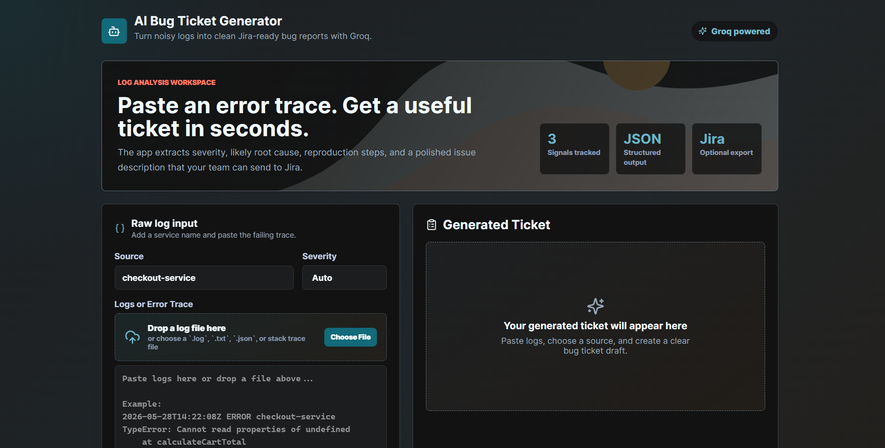

# 🐞 AI Bug Ticket Generator

### HOMEPAGE



### Dashboard

> AI-powered bug ticket generation platform that converts raw application logs and stack traces into structured, Jira-ready bug reports using Groq LLM.


---

# 📖 Overview

AI Bug Ticket Generator is a full-stack application that helps developers and QA teams automatically transform messy application logs into clear and actionable bug tickets.

Instead of manually analyzing stack traces and writing tickets, users can paste logs and instantly receive:

* Structured bug summaries
* Reproduction-ready descriptions
* Severity classification
* Jira-compatible ticket formatting
* AI-generated debugging insights

The platform can also directly create Jira issues using Jira REST API integration.

---

# ✨ Features

## 🤖 AI Bug Ticket Generation

Using Groq + Llama 3.1:

* Automatic Error Understanding
* Stack Trace Analysis
* AI Ticket Summarization
* Severity Detection
* Structured Bug Reports

---

## 🧾 Jira-Ready Tickets

Generated tickets include:

* Bug Title
* Detailed Description
* Severity Level
* Suggested Labels
* Reproduction Information

---

## 🔗 Jira Integration

* Create Jira Issues Automatically
* Jira REST API Support
* Optional Jira Configuration
* Project Key Mapping

---

## 🎨 Frontend Highlights

* Modern Responsive UI
* Clean Dashboard Design
* Fast Vite-Powered Frontend
* Easy Log Submission Experience

---

# 🏗️ System Architecture

```text
Application Logs
       │
       ▼
Log Processing
       │
       ▼
Groq AI Analysis
       │
       ▼
Bug Understanding
       │
       ▼
Structured Ticket Generation
       │
       ▼
Jira Issue Creation
```

---

# 🛠️ Tech Stack

## Frontend

* React.js
* Vite
* JavaScript
* CSS

## Backend

* Node.js
* Express.js
* Axios
* Dotenv
* CORS

## AI Layer

* Groq SDK
* Llama 3.1 70B Versatile

## Integrations

* Jira REST API

---

# 📂 Project Structure

```text
ai_bug_ticket_generator/
│
├── frontend/
│   ├── src/
│   └── package.json
│
├── backend/
│   ├── src/
│   │   ├── routes/
│   │   ├── services/
│   │   ├── utils/
│   │   └── server.js
│   │
│   └── package.json
│
├── .gitignore
└── README.md
```

---

# ⚙️ Installation

## Clone Repository

```bash
git clone https://github.com/YOUR_USERNAME/ai-bug-ticket-generator.git

cd ai_bug_ticket_generator
```

---

# 🔧 Backend Setup

Install dependencies:

```bash
cd backend

npm install
```

Create `.env`

```env
PORT=5000

CLIENT_ORIGIN=http://localhost:5173

GROQ_API_KEY=your_groq_api_key
GROQ_MODEL=llama-3.1-70b-versatile

JIRA_BASE_URL=https://your-domain.atlassian.net
JIRA_EMAIL=your-email@example.com
JIRA_API_TOKEN=your_jira_api_token
JIRA_PROJECT_KEY=BUG
```

Run backend:

```bash
npm run dev
```

Backend:

```text
http://localhost:5000
```

---

# 💻 Frontend Setup

Open a new terminal:

```bash
cd frontend

npm install

npm run dev
```

Frontend:

```text
http://localhost:5173
```

---

# 📡 API Endpoints

## Generate Bug Ticket

```http
POST /api/tickets/generate
```

### Request Body

```json
{
  "logs": "TypeError: Cannot read properties of undefined...",
  "source": "checkout-service",
  "severityHint": "High"
}
```

---

## Create Jira Ticket

```http
POST /api/tickets/create-jira
```

### Request Body

```json
{
  "ticket": {
    "title": "Checkout crashes when cart is empty",
    "description": "Steps, expected result, actual result...",
    "severity": "High",
    "labels": ["ai-generated", "logs"]
  }
}
```

---

# 🚀 Future Improvements

* Authentication System
* User Dashboard
* Saved Ticket History
* Multi-Project Jira Support
* PDF Ticket Export
* Docker Deployment
* CI/CD Integration
* Real-Time Log Monitoring

---

# 🧠 What I Learned

This project helped me learn:

* Full-Stack JavaScript Development
* REST API Design
* AI Integration using Groq SDK
* Prompt Engineering
* Jira REST API Integration
* Backend Architecture
* Frontend-Backend Communication
* Error Parsing & Log Processing

---

# 🎥 Demo Video

🔗(https://youtu.be/_dbkwmWPSf4)

---
