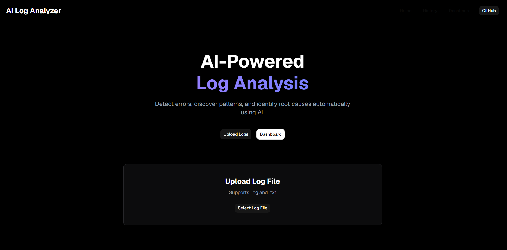

# 🚀 AI-Powered Log Analyzer

### HOMEPAGE


### Dashboard

> AI-powered log analysis platform that detects failures, identifies recurring patterns, generates root-cause analysis, and stores historical reports using MongoDB Atlas.


---

## 📖 Overview

AI-Powered Log Analyzer is a full-stack application that helps developers and DevOps engineers quickly identify issues hidden inside large log files.

Instead of manually inspecting thousands of log entries, users can upload a log file and receive:

- Error summaries
- Failure patterns
- Root cause analysis
- Actionable recommendations

All analysis reports are stored in MongoDB Atlas and can be accessed through the History Dashboard.

---

## ✨ Features

### 📂 Log Analysis

- Upload `.log` and `.txt` files
- Automatic log parsing
- Error detection
- Warning detection
- Information log classification

---

### 🤖 AI Root Cause Analysis

Using Groq + Llama 3.3:

- Root Cause Detection
- Failure Pattern Identification
- AI Recommendations
- Intelligent Error Summarization

---

### 🗄️ Analysis History

- MongoDB Atlas Integration
- Persistent Storage
- View Previous Reports
- Clear History Functionality

---

### 🎨 Frontend Highlights

- Modern Dark Theme UI
- Responsive Layout
- Tailwind CSS
- Shadcn UI Components
- Clean Dashboard Experience

---

## 🏗️ System Architecture

```text
Log File Upload
       │
       ▼
Log Parser
       │
       ▼
Error Classification
       │
       ▼
Groq AI Analysis
       │
       ▼
Root Cause Analysis
       │
       ▼
MongoDB Storage
       │
       ▼
History Dashboard
```

---

## 🛠️ Tech Stack

### Frontend

- React.js
- Vite
- Tailwind CSS
- Shadcn UI
- Axios
- React Router DOM

### Backend

- Node.js
- Express.js
- Multer
- Mongoose
- CORS
- Dotenv

### Database

- MongoDB Atlas

### AI Layer

- Groq API
- Llama 3.3 70B Versatile

---

## 📂 Project Structure

```text
ai-powered-log-analyzer/
│
├── frontend/
│   ├── src/
│   │   ├── components/
│   │   ├── pages/
│   │   ├── services/
│   │   └── App.jsx
│   │
│   └── package.json
│
├── backend/
│   ├── src/
│   │   ├── config/
│   │   ├── controllers/
│   │   ├── models/
│   │   ├── routes/
│   │   ├── services/
│   │   └── server.js
│   │
│   └── package.json
│
├── .gitignore
└── README.md
```

---

## ⚙️ Installation

### Clone Repository

```bash
git clone https://github.com/YOUR_USERNAME/ai-powered-log-analyzer.git

cd ai-powered-log-analyzer
```

---

## 🔧 Backend Setup

Install dependencies:

```bash
cd backend
npm install
```

Create `.env`

```env
PORT=5000

GROQ_API_KEY=your_groq_api_key

MONGO_URI=your_mongodb_connection_string
```

Run backend:

```bash
npm run dev
```

Backend:

```text
http://localhost:5000
```

---

## 💻 Frontend Setup

Open a new terminal:

```bash
cd frontend

npm install

npm run dev
```

Frontend:

```text
http://localhost:5173
```

---

## 📡 API Endpoints

### Analyze Logs

```http
POST /api/analyze
```

### Get History

```http
GET /api/history
```

### Clear History

```http
DELETE /api/history/clear
```

---

## 🚀 Future Improvements

- JWT Authentication
- User-Specific Analysis History
- Dashboard Analytics
- PDF Report Export
- Role-Based Access Control
- Real-Time Log Monitoring
- Docker Deployment

---

## 🧠 What I Learned

This project helped me learn:

- Full-Stack MERN Development
- MongoDB Atlas Integration
- REST API Design
- File Upload Handling with Multer
- AI Integration using Groq API
- Prompt Engineering
- React Component Architecture
- State Management
- Production Project Structure

---

## 🎥 Demo Video

🔗(https://youtu.be/OzMuwc9fIpg)

---
