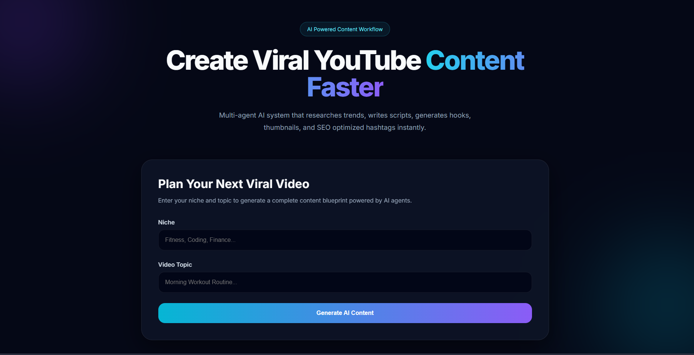

# 🚀 YouTube Content Assistant


### Homepage



> AI-powered content generation platform that uses multiple specialized agents to create YouTube titles, hooks, scripts, thumbnail text, and SEO metadata.


---

## 📖 Overview

YouTube Content Assistant is a full-stack AI application that helps content creators generate complete video plans in seconds.

Instead of relying on a single prompt, the application follows a **multi-agent workflow**, where dedicated AI agents handle research, script generation, and SEO optimization independently.

The result is more structured, focused, and production-ready content.

---

## ✨ Features

### 🎬 Content Generation

Generate:

- Viral Video Titles
- Viewer-Retention Hooks
- Structured Video Scripts
- Thumbnail Overlay Text
- SEO Optimized Hashtags
- Content Strategy Blueprints

---

### 🤖 Multi-Agent Architecture

The application uses three specialized AI agents:

| Agent | Responsibility |
|---------|---------|
| 🔍 Trend Research Agent | Identifies audience pain points and trending angles |
| ✍️ Script Writer Agent | Creates titles, hooks, and complete scripts |
| 📈 SEO Optimizer Agent | Generates hashtags, metadata, and thumbnail text |

---

### 🎨 Frontend Highlights

- Modern Glassmorphism Design
- Dark Theme UI
- Responsive Layout
- Smooth Animations
- Custom Loading States
- Dynamic Content Rendering

---

## 🏗️ System Architecture

```text
User Input
    │
    ▼
Trend Research Agent
    │
    ▼
Script Writer Agent
    │
    ▼
SEO Optimizer Agent
    │
    ▼
Structured JSON Response
    │
    ▼
React Dashboard
```

---

## 🛠️ Tech Stack

### Frontend

- React.js
- Vite
- CSS3
- Fetch API

### Backend

- Node.js
- Express.js
- CORS
- Dotenv

### AI Layer

- Groq API
- Llama Models
- JSON Schema Validation

---

## 📂 Project Structure

```text
youtube-content-assistant/
│
├── frontend/
│   ├── src/
│   │   ├── features/
│   │   │   ├── FormSection.jsx
│   │   │   └── ResultsSection.jsx
│   │   │
│   │   ├── services/
│   │   │   └── api.service.js
│   │   │
│   │   ├── App.jsx
│   │   ├── main.jsx
│   │   └── index.css
│   │
│   └── package.json
│
├── backend/
│   ├── src/
│   │   ├── agents/
│   │   ├── routes/
│   │   └── app.js
│   │
│   ├── server.js
│   └── package.json
│
├── .gitignore
└── README.md
```

---

## ⚙️ Installation

### Clone Repository

```bash
git clone https://github.com/Taksh-Agrl/youtube-content-assistant.git

cd youtube-content-assistant
```

---

## 🔧 Backend Setup

Install dependencies:

```bash
cd backend
npm install
```

Create `.env`

```env
PORT=5000
GROQ_API_KEY=your_api_key_here
```

Run backend:

```bash
npm run dev
```

Backend:

```text
http://localhost:5000
```

---

## 💻 Frontend Setup

Open a new terminal:

```bash
cd frontend
npm install
npm run dev
```

Frontend:

```text
http://localhost:5173
```

---


## 🚀 Future Improvements

- User Authentication
- Content History
- MongoDB Integration
- AI Thumbnail Generation
- YouTube API Integration
- PDF Export
- Multi-Language Support

---

## 🧠 What I Learned

This project helped me learn:

- Full-Stack Development
- React Component Architecture
- REST APIs
- Prompt Engineering
- AI Workflow Orchestration
- Async JavaScript
- Frontend State Management

---

## 🎥 Demo Video

🔗 Watch the project demo:

https://youtu.be/K0tXds3pzak

---

